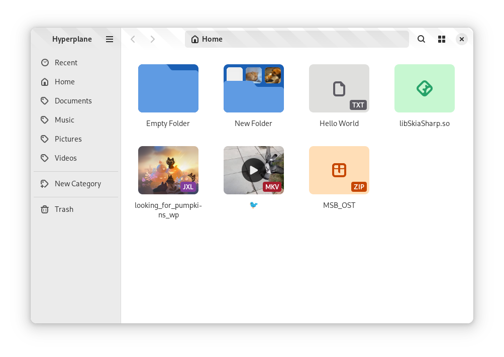

  

  # Hyperplane

  A non-hierarchical file manager

  

> [!WARNING]
> This project is currently in **ALPHA**. You can try it out at your own risk, but be aware that things **will** break, it **will** have annoyances, **DATA LOSS** may occur and it may kill your cat.

I provide builds **strictly for testing**. Please do not use it as your actual file manager, and for the love of god, **DO NOT** give it access to your home directory.

# The project

The problem is that current methods for tagging files are OS-, file system- or application-specific and not portable.

The app was primarily built as a proof of concept for a non-hierarchical file manager whose storage can still be conveniently browsed via conventional file managers.

It is also a playground for design ideas like file extension badges or a symbolic grid view. 

## The concept

Hyperplane stores its 'tags' (called categories) on disk as regular directories.

File A tagged 'Pictures', 'Art' and 'Animals' would be stored at `/Pictures/Art/Animals/` on disk.

File B tagged 'Videos' and 'Art' would be stored at `/Videos/Art/`.

When filtering for files tagged 'Art' however, both of these would show up.

The app keeps track of the list of categories in a `.hyperplane` file at the root of the Hyperplane directory. (This is currently `$XDG_DATA_HOME/hyperplane/home/` by default, but will likely be `$HOME` when the app enters beta.)

## The name

https://en.wikipedia.org/wiki/Hyperplane

It is subject to change.

# Testing

The project is currently at the MVP stage. Basic features work, but user experience is poor and issues will arise.

You can download the latest Flatpak build from the [Actions page](https://github.com/kra-mo/hyperplane/actions).

After installing it, you can place files in `~/.var/app/hu.kramo.Hyperplane.Devel/data/hyperplane/home/` to test the app.

Please report any and all issues you find!

# Contributing

The project's future is uncertain. If you want to help with code or design, please reach out or file an issue before making a pull request. That being said, I appreciate any help!

## Translations

Strings are nowhere near final, I will set up translations closer to an initial release.